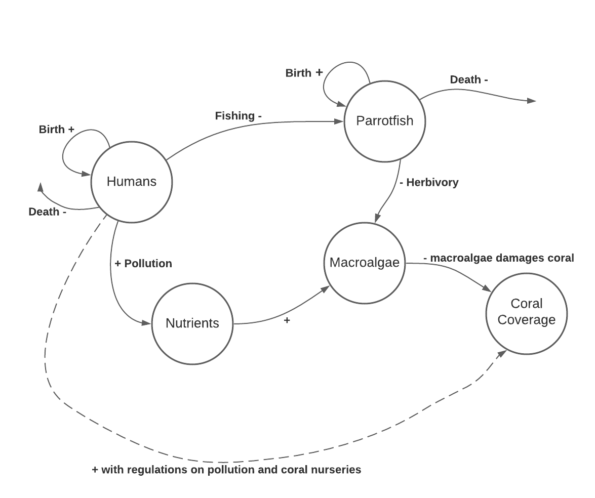
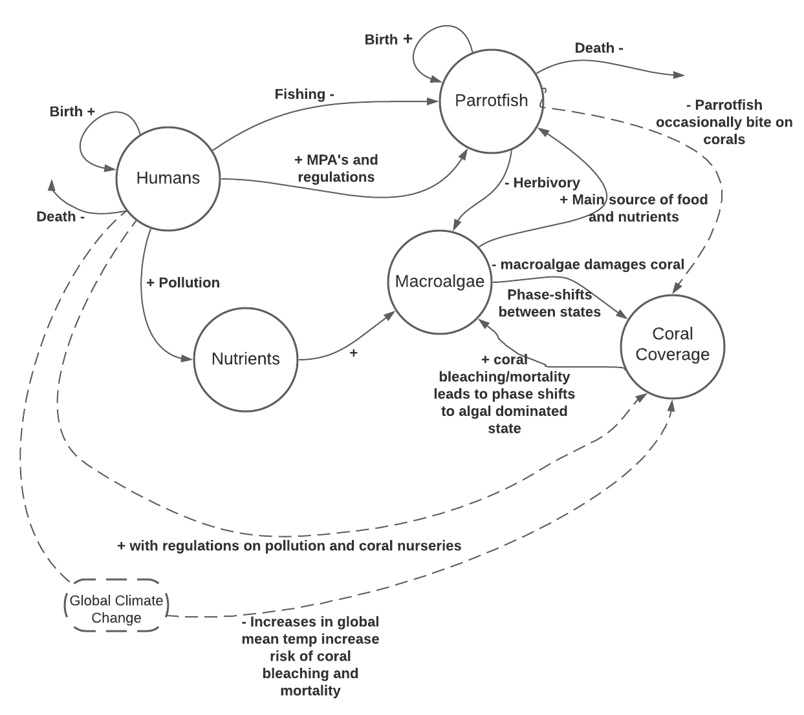

```{r setup, include=FALSE}
knitr::opts_chunk$set(echo = TRUE)
```

##### 1.
Individual Flow Diagram:


##### 2. 
Group Flow Diagram:

##### 3.
Model Flow Diagram:


##### 4.
```{r}
require(deSolve)

# Initial values
state <- c(M=10,P=10,T=10,C=10)
times <- seq(0,100,by=0.1)


# Parameters
parameters <- c(a = 0.1,g=0.8,r=1.0,d=0.44,s=0.49,K=10)


# Model
coral_model <- function(t,state,parameters){
  with(as.list(c(state,parameters)),{
    dM <- (a*M*C) -((P*M)/(M + T))+ (g*M*T)
    dC <- (r*T*C)-(d*C)-(a*M*C)
    dT <- ((P*M)/(M + T))-(g*M*T)-(r*T*C)+(d*C)
    dP <- (s*P)*(1-(P/K))
    list(c(dM,dC,dT,dP))   
  })}
```
##### 5.
```{r}
# Solve model and plot results
out <- ode(y = state,times=times,func=coral_model,parms=parameters)
par(mfrow=c(1,1))
plot(out,ylab='N',xlab='time',las=1, xlim=c(0,10))
```

a. With the parameters set as the given values, the macroalgae population will grow while all the other populations will decline to zero.


b. The parameter that would have the greatest impact on the population is 'a', the competition between macroalgae and coral. A 0.1 increase in 'a' will cause all the populations other than macroalgae to decline to zero at a faster rate.The macroalgae population will increase faster at first, but will start to decline soon as all the other populations drop to zero. 

```{r, echo=FALSE}
require(deSolve)

# Initial values
state <- c(M=10,P=10,T=10,C=10)
times <- seq(0,100,by=0.1)


# Parameters
parameters <- c(a = 0.2,g=0.8,r=1.0,d=0.44,s=0.49,K=10)


# Model
coral_model <- function(t,state,parameters){
  with(as.list(c(state,parameters)),{
    dM <- (a*M*C) -((P*M)/(M + T))+ (g*M*T)
    dC <- (r*T*C)-(d*C)-(a*M*C)
    dT <- ((P*M)/(M + T))-(g*M*T)-(r*T*C)+(d*C)
    dP <- (s*P)*(1-(P/K))
    list(c(dM,dC,dT,dP))   
  })}
out <- ode(y = state,times=times,func=coral_model,parms=parameters)
par(mfrow=c(1,1))
plot(out,ylab='N',xlab='time',las=1, xlim=c(0,10))